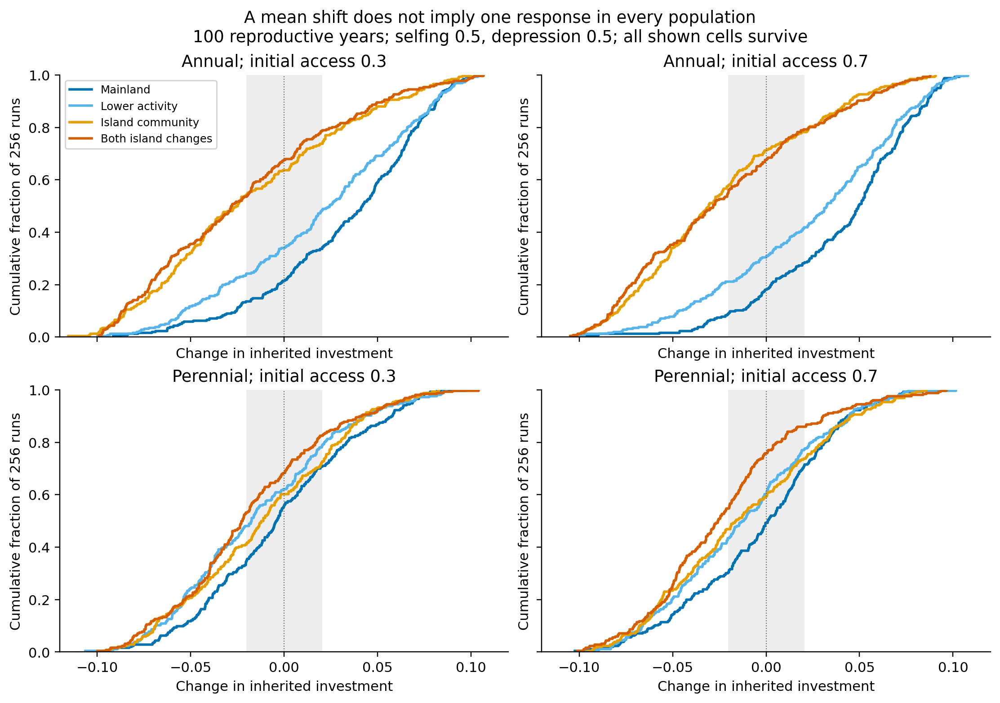
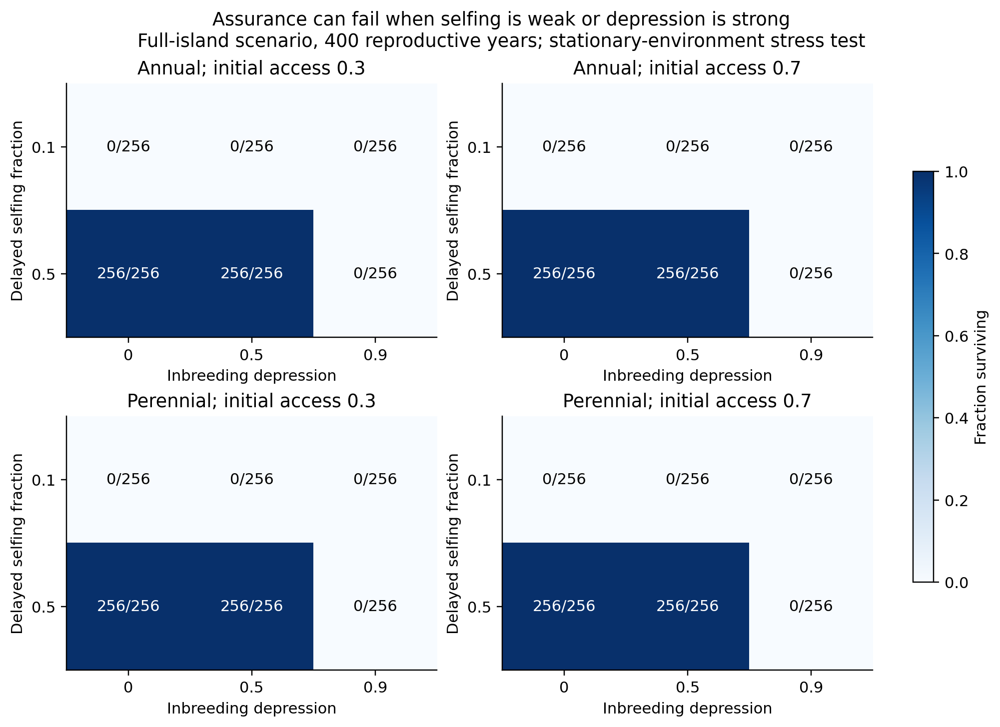
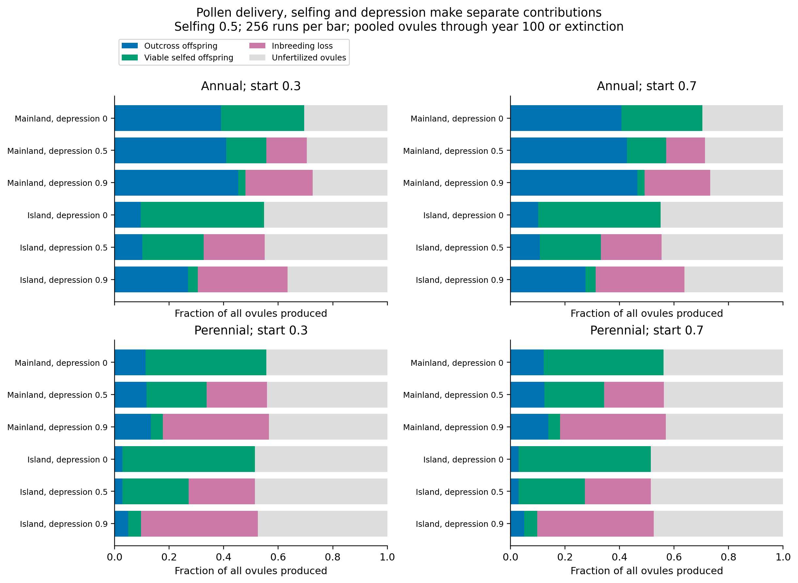
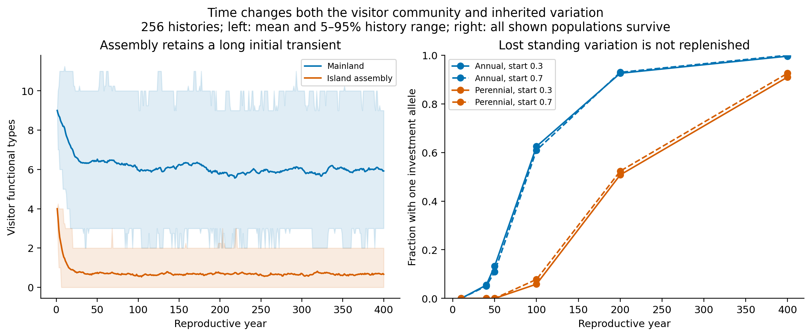
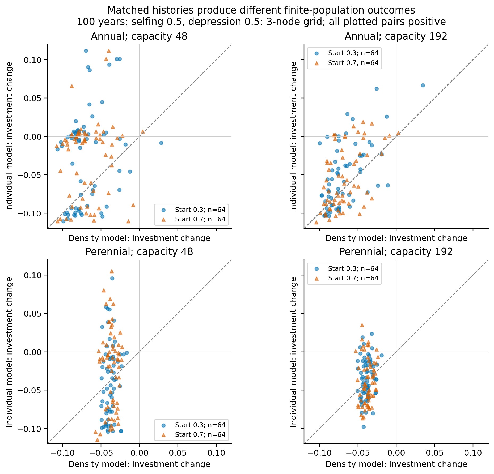

# Floral evolution under island pollination: verified model3 results

**Answer:** the model produces inherited floral investment shifts and divergent
population trajectories, but not a universal island flower. Reproductive
assurance determines whether populations persist long enough for an evolutionary
endpoint to exist. Strong inbreeding depression can remove that assurance.
These are conditional theoretical results, not a reconstruction of actual islands.

## What was run and verified

|Prospective campaign|Runs or matched pairs|Artifacts|Exact replay checks|
|---|---:|---:|---:|
|Continuous-founder baseline and capacity sensitivity|28,672|160|160|
|Selfing, depression and reproductive-effort sensitivity|30,720|120|120|
|Matched individual/distribution comparison|2,560|64|64|

All61,952cases/pairs passed whole-artifact validation;344cases were re-executed
with exact array equality. These are scenario counts, not independent biological
replicates: seeds are shared across paired interventions. The baseline primary
and assurance cells each contain256independent histories; capacity sensitivity
and primary grid comparison have64, grid refinement16. Worst-case approximate
95%binomial Monte Carlo half-widths are6.1,12.3and24.5percentage points respectively.
Rare events, survivor-conditioned estimates with few pairs and grid refinement
are consequently less precise. No failed or extinct trajectory was discarded.

Designs, executable hashes, manifest hashes, validation receipts and summary
provenance remain separate. Original archived models were not overwritten.
`MODEL3_RESULT_READING_PROTOCOL_20260925.md` defines the estimands and denominators.
Raw NPZ trajectories remain in the local campaign directories; compact tables,
compressed checkpoint rows and receipts accompany this report in the branch.
The frozen runners reproduce raw trajectories; a remotely archived raw-data
deposit is not claimed by this report.

## Ecological model and what changed

Plants carry two additive diploid loci: an abstract access/matching trait and
an investment trait that raises attractiveness but reduces ovule supply through
a cost. Each reproductive year, visitor functional types deliver finite pollen
doses to compatible recipients. Saturating receipt produces outcross offspring;
delayed selfing can fertilize remaining ovules. A fixed depression parameter
reduces viable selfed offspring. Female and male contributions enter Mendelian
inheritance before Poisson recruitment, density regulation and adult survival.
Thus inherited response, demographic sampling and extinction are outcomes of
reproduction; no rule explicitly moves a flower toward the best visitor.

The island intervention changes visitor assembly and activity. Four baseline
environments separate activity alone, community process alone, both changes,
and mainland. Selected and neutral parental contributions distinguish trait-
dependent reproductive advantage from random transmission, without pretending
that future demographic states remain identical. A fixed-trait control has
numerical trait change below9e-16 among survivors. Visitor entries represent
functional types, not counted insect individuals; pollen quantities are abstract
effective doses, not measured grain counts.

## Mean shift and population diversity coexist

At100years in the full-island scenario, selfing0.5/depression0.5, all256selected
and neutral populations survived in each start/life-history cell. Mean investment
changes ranged from-0.0180to-0.0229. Selected-minus-neutral contrasts ranged
from-0.0151to-0.0220, with Monte Carlo SE0.0033to0.0044. These are not
multiplicity-adjusted tests or uncertainty estimates for natural populations.

Figure1 shows every replicate through its empirical cumulative distribution;
the grey band is the predefined small-change range[-0.02,0.02]. Leftward shifts
indicate more reductions, not identical outcomes. Community-only and combined
island interventions largely overlap in annual plants under these settings;
reduced activity alone does not reproduce the same distribution. Perennial
effects are smaller at the same100-year calendar horizon.

Access responses remain mixed. At100years, annual low/high-start pairs in the
full-island selected treatment showed111distance reductions,39small changes
and106increases out of256; perennial counts were94/72/90. Mean distance changes
were-0.00597and-0.00132. Because founder supports are disjoint, this cannot
establish convergence to one shared optimum. Increasing and decreasing branches
are model population outcomes, not identified Q1 regions.

## Assurance and depression change persistence, not just effect sizes

Without selfing, no selected full-island population survived to100years in any
start/life-history cell. The same was true under neutral inheritance. This is
an endpoint failure, with undefined trait values, not a zero evolutionary effect.
Even mainland obligate-outcrossing annuals retained only117/256and155/256
at the two starts; the model is not calibrated to mainland persistence.

At400years, all selected full-island cells with selfing0.1 had0/256survivors,
including depression0. At selfing0.5, depression0and0.5 retained256/256, whereas
depression0.9 retained0/256. Strong depression therefore prevents endpoint
directional inference in these cells. Mainland annual high-depression cells
still retained10–24survivors, so this is not a universal extinction result.

Figure4 uses selfing0.5and256runs per bar. Fractions pool all produced ovules
through100years or extinction. Blue is outcross offspring; green viable selfed
offspring; pink expected loss due to depression; grey remaining unfertilized
ovules. These are before density regulation. Pooled fractions weight productive
years and differ in exposure duration when populations die; they are not a
causal estimate of a field supplementation treatment. Actual established
recruits and potential recruits are separate columns in checkpoint tables.

Ecologically, assurance can relax the reproductive benefit of costly attraction
when compatible visitors are absent. However, the chosen selfing0.5/depression0.5
already permits above-replacement visitor-free reproduction under baseline
allocation. This is a declared mechanism in the equations, not a new empirical
discovery. Depression is fixed; genetic load, purging and selfing-rate evolution
are absent. The model tests consequences of those states, not their origin.

## Life history, time and capacity

Reproductive years are the time unit. Annual100years and perennial400years
correspond to the declared adult replacement-time proxy; these are not measured
generation lengths. At400years, baseline full-island mean investment changes
were-0.0250/-0.0264 for annual starts and-0.0307/-0.0370 for perennial starts.
No geological timescale or stationary natural-island history is inferred.

Figure5 reports actual visitor trajectories (mean and5–95%history range) and
loss of investment alleles. Under full-island selfing0.5, annual populations
were monomorphic for investment in160/256and156/256runs by100years; perennial
counts were15/256and20/256. By400years these counts reached255/256,256/256,
233/256and237/256respectively. Late stability therefore often reflects loss
of standing variation, not proof of an optimum or evolutionary equilibrium.

The declared environmental-to-plant replacement ratios are:

|Life history / assembly|Visitor residence / plant replacement|Arrival waiting time / plant replacement|
|---|---:|---:|
|Annual / mainland|20|3.33|
|Annual / island|6.67|10|
|Perennial / mainland|5|0.833|
|Perennial / island|1.67|2.5|

Expected visitor richness approaches6or2/3from starting counts9or4. Community
intervention includes richness, turnover and transient history; it does not
isolate species identity alone. Two within-year flowering episodes use the same
community, so they are not two independent histories. Adult survival changes
exposure across years; it is not a calibrated conversion of life span into the
old model's independent-history pooling parameter k.

Separating pollen and ovule effort is important because fertilization is
nonlinear. At400years, full-island perennial effort interventions retained
256/256survivors and negative mean changes ranging-0.0162to-0.0295. One mean
lies within the predeclared small-change band. Individual directions vary and
some early means are positive. Mainland annual-pollen interventions instead
produced positive means+0.0214to+0.0261. The life-history result is therefore
conditional on resource allocation, not longevity alone.

Capacity192full-island baseline populations with selfing0.5had64/64survivors
and investment changes-0.0580to-0.0648at400years, larger than capacity48changes.
Selected-minus-neutral contrasts remained negative. This supports a finite-
population effect on response magnitude, but capacity also scales background
pollen loss and does not independently test that parameter.

The natural-history rationale in `MODEL3_NATURAL_HISTORY_TIMESCALES_20260925.md`
uses colonization/succession evidence from Surtsey and short experimental floral
evolution to motivate separate processes and observation windows. It does not
calibrate these exact rates.400years is a stationary-environment stress test,
with no mutation, plant immigration, age at first reproduction or succession.

## Individual versus distribution counterpart

Both arms start with identical projected founding genotypes and share visitor
history. The distribution arm retains the exact Mendelian kernel but removes
demographic sampling and finite-individual pollen self-exclusion. It is a
discrete reproductive operator, not a diffusion PDE and not the exact mean
trajectory of the finite process.

All sampled individual and density endpoints were positive in this assurance
regime; the comparison does not demonstrate an extinction discrepancy. At100years,
annual full-island capacity48investment means were0.0395–0.0427higher than the
density counterpart; capacity192differences were0.0136–0.0169. Stochastic
trajectories can oppose the deterministic direction, but the contrast also
contains finite pollen self-exclusion and is not genetic drift alone.

Three-to-four-node refinement changed density investment by up to0.0113 and
individual investment by up to0.0314 across sampled cells/checkpoints, with
only16refinement histories. Numerical convergence is not established. The
comparison is diagnostic evidence for finite-population and discretization
effects, not a resolution-independent PDE result.

## What can be claimed, and what cannot

Supported: in these declared scenarios, visitor assembly, reproductive assurance,
resource allocation and finite-population dynamics jointly alter the distribution
of inherited floral investment and persistence. A mean shift can coexist with
opposing individual trajectories. Weak assurance or strong depression can remove
the populations whose endpoint evolution one hoped to compare.

Not established: a universal island floral direction, natural island calibration,
four-region reproduction, macroevolutionary origins, quantitative transport to
42island systems, a unique optimum, resolution-independent density dynamics or
robustness over all source pools and fitness costs. The uniform source-pool
geometry and finite founder ranges remain active constraints. Wider source-pool,
fitness-cost, discounting and spatial models would be separately declared work;
this completed campaign does not certify them. No such claim should be added
to the poster or manuscript merely because computation passed validation.

The user's later scope decision made Q1 inspiration only. Consequently no
four-region concordance test or fitting was performed. For real islands, the
testable measurements are visitor absence/turnover, pollen delivery, autonomous
selfing, offspring viability and recruitment, with flower investment tracked
through time. Mapping these observations to model parameters requires independent
data; geographical region is not a substitute for those mechanisms.
